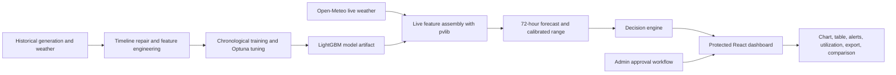

# GreenCast

## Renewable Energy Forecasting and Grid Decision Support

GreenCast converts live weather forecasts into an operationally useful 72-hour solar generation forecast. It combines a time-aware LightGBM model, calibrated uncertainty ranges, explainable grid-action flags, authenticated access, and an interactive dashboard for Plant 1 monitoring and What-if site exploration.

**Hackathon project:** HackOut 2026, Synapse
**Team:** The Final Commit, Dhirubhai Ambani University
**Domain:** Renewable energy forecasting, energy operations, machine learning, decision support

> **One-line value proposition:** GreenCast helps renewable-energy operators anticipate generation, understand uncertainty, and act before supply conditions change.

---

## Live Demo

| | |
|---|---|
| **Frontend (dashboard)** | https://renewable-forecast-platform.vercel.app/ |
| **Backend (API + Swagger docs)** | https://renewable-forecast-platform.onrender.com/docs |

### Judge login (admin account)

| Field | Value |
|---|---|
| Login type | Admin |
| Username | `Admin` |
| Password | `GreenCastAdmin123!` |

> The backend runs on Render's free tier, so the first request after a period of inactivity can take 30–50 seconds to wake up (cold start). If the dashboard looks stuck loading on first visit, wait a moment and retry.

**Suggested judge flow:**
1. Open the frontend link above.
2. Log in with the admin credentials to see the account-approval console — or sign up as a new user (a six-digit employee ID is required) and approve that request from the admin console in another tab.
3. Log in as the approved user and explore the Plant 1 forecast dashboard: chart/table views, 24/48/72h controls, alerts, and CSV export.
4. Try What-if mode with any location and capacity.

---

## 1. The Problem

Renewable generation is variable, but grid and plant decisions must be made ahead of time. A solar operator needs to know:

- How much power is likely to be generated over the next 24–72 hours.
- When generation may be unusually low and backup or storage may be needed.
- When generation may approach capacity and curtailment planning may be required.
- How uncertain the forecast is at each future horizon.
- Whether the forecast changed materially after new weather information arrived.

A simple time-of-day average is not enough. It misses cloud-driven variation, changes in weather, sunrise and sunset behavior, and the increasing uncertainty of longer horizons. A useful system must combine prediction with context and action.

## 2. Our Solution

GreenCast is a three-layer system:

1. **Forecasting:** a production-consistent LightGBM model predicts hourly solar AC power for horizons 1–72 hours ahead.
2. **Decision support:** a rule-based engine converts the forecast into `normal`, `curtail`, or `backup_dispatch` recommendations using capacity-relative thresholds.
3. **Operator experience:** a protected React dashboard presents trends, uncertainty, exact hourly values, utilization, alerts, explanations, comparisons, and CSV export.

The design deliberately favors honest deployment behavior. The model uses only features available during live inference. It does not depend on artificial current-power placeholders or claim site generalization that has not been validated.

---

## 3. Measured Results

The final model was evaluated on an untouched chronological test window. The test period was never used for tuning or interval calibration.

| Model | MAE (kW) | RMSE (kW) | Daytime MAPE | Night/near-zero MAE (kW) |
|---|---:|---:|---:|---:|
| Linear regression baseline | 424.3 | 663.2 | 19.8% | 167.5 |
| XGBoost | 353.9 | 692.2 | 8.7% | 11.8 |
| **Optuna-tuned LightGBM** | **291.7** | **609.6** | **5.8%** | **1.8** |

### What these numbers mean

- LightGBM reduces MAE by **31.2% versus the linear baseline**: $(424.3 - 291.7) / 424.3$.
- It reduces daytime MAPE from **19.8% to 5.8%**, a **70.7% relative reduction**.
- It maintains very low nighttime error because nighttime generation is physically zero and explicitly enforced at the API boundary.
- Horizon-specific LightGBM MAE remains stable: **292.5 kW at 1–24 hours**, **301.2 kW at 25–48 hours**, and **278.1 kW at 49–72 hours** on this test window.

MAPE is calculated only where actual generation exceeds 100 kW because approximately 46.6% of target rows are exactly zero at night. Night performance is reported separately using MAE instead of hiding the zero-generation behavior inside an invalid percentage metric.

Full methodology and results: [docs/MODELING.md](docs/MODELING.md).

---

## 4. Why This Approach Is Defensible

### Chronological evaluation, not random splitting

Random splitting would allow adjacent timestamps and future weather patterns to leak into training. GreenCast uses:

- **Train:** all rows before the validation period.
- **Validation:** the next six days, used for interval calibration and model selection logic.
- **Test:** the final six days, touched once for final reporting.

LightGBM tuning uses three spaced chronological four-day validation windows, 20 Optuna TPE trials, regularization, subsampling, and early stopping.

### Live-consistent feature contract

The final model uses nine features available from weather, timestamps, or pvlib solar calculations:

1. Issue-time ambient temperature
2. Issue-time clear-sky index
3. Issue hour
4. Day of year
5. Forecast horizon in hours
6. Target-time ambient temperature
7. Target-time irradiation
8. Target-time solar elevation
9. Target-time daytime indicator

Three historical current-power features were removed because the prototype has no SCADA feed. Keeping them would have meant training on real historical power but serving constant zero placeholders at inference. The final model accepts a measured accuracy trade-off in exchange for deployment integrity.

### Uncertainty is calibrated separately from point prediction

The dashboard shows a prediction interval calibrated on validation residuals, not on the final test set:

| Horizon | 90th-percentile absolute residual |
|---|---:|
| 1–24 hours | 692.1 kW |
| 25–48 hours | 766.5 kW |
| 49–72 hours | 895.5 kW |

The widening band communicates a practical truth: longer-horizon forecasts carry more uncertainty.

---

## 5. Product Capabilities

### Authentication and authorization

- Public GreenCast landing and access-request screen.
- User signup requires display name, unique username, password, and an exactly six-digit employee ID.
- Signup creates a `pending` request; it does not issue a dashboard token.
- A separate administrator login opens the account-request console.
- Admins approve or reject employee requests.
- Only approved users can sign in and access forecast data.
- Passwords use salted PBKDF2-HMAC-SHA256 hashing.
- JWT bearer tokens expire after eight hours.
- Forecast history is scoped to the authenticated user.

### Forecast dashboard

| Capability | User value |
|---|---|
| Forecast summary | Quickly see next-hour output, 72-hour peak, forecast window, and active alerts. |
| Chart view | Understand the generation curve, uncertainty band, nighttime periods, and action markers. |
| Table view | Inspect exact hourly values, bounds, capacity utilization, and recommended action. |
| 24/48/72-hour controls | Focus the view on immediate planning or the complete forecast horizon. |
| CSV export | Use the selected forecast window in reports or operational workflows. |
| Capacity utilization | Interpret output as a percentage of available site capacity. |
| Alert explanations | Understand why curtailment or backup dispatch was recommended. |
| Timezone and freshness | Avoid misreading timestamps and know when data was refreshed. |
| Forecast comparison | See how predictions changed between matching saved runs. |
| Forecast guide | Understand expected output, possible range, action flags, and What-if limitations. |

### Two operating modes

- **Plant 1:** validated reference mode using the fixed dataset site configuration and live weather.
- **What-if site:** search for a location, choose a geocoded result, provide capacity, and explore a capacity-scaled estimate. This mode is explicitly labeled approximate because the model was trained on Plant 1.

---

## 6. End-to-End Architecture



### Repository map

```text
data/       source generation and weather CSVs
ml/         dataset construction, EDA, model training, model artifacts
backend/    FastAPI API, authentication, SQLite persistence, decision engine
frontend/   React dashboard, auth screens, charts, table, export, admin console
docs/       methodology, decisions, modeling, backend, frontend, project plan
```

---

## 7. Local Setup

### Windows PowerShell

```powershell
cd "C:\Users\ajudi\OneDrive\Desktop\Hackout\Renewable-Forecast-Platform"
py -3.13 -m venv venv
.\venv\Scripts\Activate.ps1
python -m pip install -r requirements.txt

# Required outside local development. Use a long random value.
$env:GREENCAST_AUTH_SECRET = "replace-with-a-long-random-secret"
$env:GREENCAST_ADMIN_USERNAME = "admin"
$env:GREENCAST_ADMIN_PASSWORD = "replace-with-a-strong-admin-password"
```

Start the backend in Terminal 1:

```powershell
cd backend
python -m uvicorn main:app --reload
```

Start the frontend in Terminal 2:

```powershell
cd frontend
npm install
npm run dev
```

Open the Vite URL, usually `http://localhost:5173`. The API documentation is at `http://localhost:8000/docs`.

### First-use flow

1. Log in as the configured administrator.
2. In another browser session, submit a user account request with a six-digit employee ID.
3. In the admin console, review and approve the request.
4. Log in through User login with the approved account.
5. Explore the forecast dashboard and its nine decision-support features.

For Linux/macOS setup and deeper implementation details, see [docs/FRONTEND.md](docs/FRONTEND.md) and [docs/BACKEND.md](docs/BACKEND.md).

---

## 8. Testing and Quality Evidence

The current backend suite contains **17 passing tests** covering:

- Missing authentication and protected routes
- Signup, duplicate usernames, password verification, and pending approval
- Six-digit employee ID validation
- Admin approval and rejection paths
- Admin-only endpoint authorization
- User-scoped history isolation
- Forecast response shape and physical bounds
- Nighttime zero enforcement
- What-if capacity scaling and output capping
- Geocoding fallback behavior
- Weather failure handling
- Feature-importance normalization

Frontend validation includes a successful production build and static diagnostics checks. The only build warning is the Recharts bundle-size advisory; it does not affect correctness.

---

## 9. Known Limitations and Responsible Claims

- Evaluation uses one short historical period from one solar plant.
- Backtesting uses target-time historical weather as a proxy for weather forecasts, so live accuracy may be lower.
- What-if mode is capacity-scaled exploration, not site-specific certification.
- The prototype does not yet ingest real SCADA telemetry, market prices, demand, panel geometry, or storage state.
- Decision thresholds are practical capacity-based proxies, not a replacement for grid-market data.
- SQLite and the local default admin configuration are appropriate for a hackathon prototype, not a production deployment without hardening.
- A production deployment should use managed persistence, secret management, HTTPS, rate limiting, audit logs, and a stronger identity-verification process.

These limitations are part of the engineering story: GreenCast makes explicit what is validated today and what must be added before operational deployment.

---

## 10. Future Impact

The next highest-value extensions are:

1. Add real SCADA current-power features after collecting historical SCADA data and retraining.
2. Compare forecasts with actual generation to measure live error and bias.
3. Add weather-context explanations such as irradiance, cloud cover, sunrise, and sunset.
4. Integrate storage state, demand, market prices, and curtailment cost.
5. Generalize across multiple sites and renewable technologies.
6. Add scheduled retraining, monitoring, drift detection, and forecast-quality alerts.

The long-term direction is an auditable renewable operations layer: not only predicting energy, but connecting prediction quality, uncertainty, and recommended action in one workflow.

---

## Documentation Index

- [Modeling and evaluation](docs/MODELING.md)
- [Data, feature engineering, and decisions](docs/DECISIONS.md)
- [Exploratory data analysis](docs/EDA.md)
- [Backend, API, auth, and persistence](docs/BACKEND.md)
- [Frontend, UX, and feature usage](docs/FRONTEND.md)
- [Project plan and sprint status](docs/Project_Plan.md)

## License

MIT — see [LICENSE](LICENSE).
