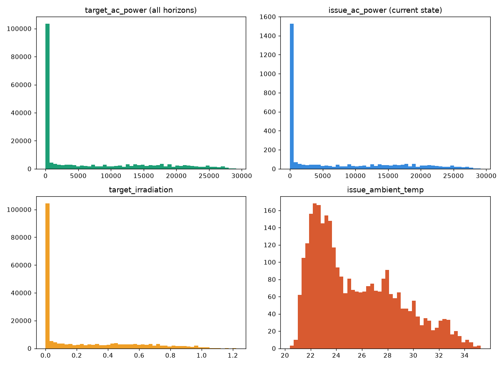
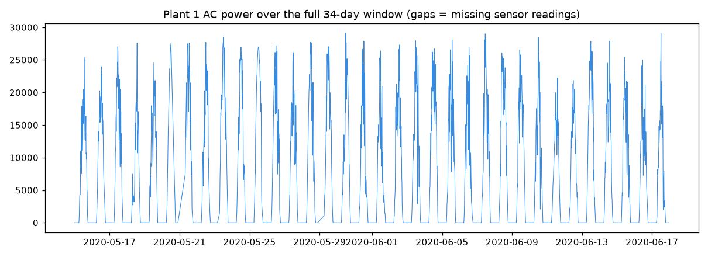
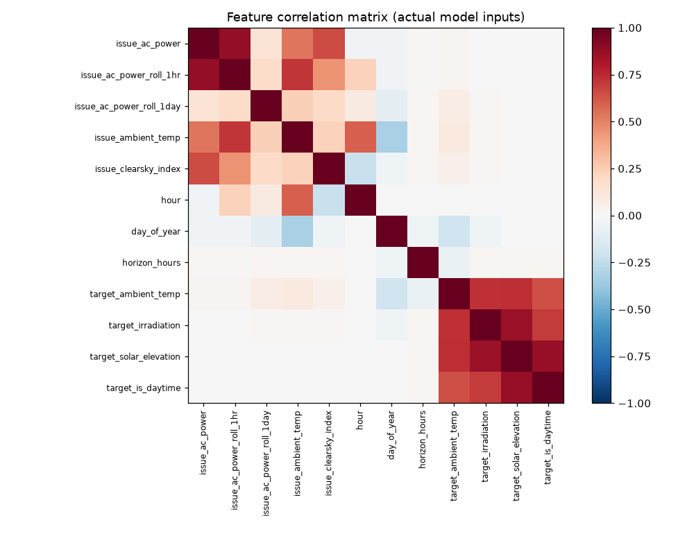

# EDA — Plant 1 forecast dataset

Standard-procedure checks run on `data/plant1_forecast_dataset.csv` (210,340 rows,
72 horizons) before modeling. Script: `ml/eda.py`. Figures: `docs/eda/*.png`.

## 1. Shape and missing values

Full horizon-stacked dataset: 210,340 rows × 15 columns.
De-duplicated per-issue-time view (horizon = 1): 3,126 rows.

**Finding not caught earlier:** the original build script only dropped rows missing
`issue_ac_power`, `target_ac_power`, `target_ambient_temp`, or `target_irradiation`.
Three other columns still carry real NaNs in the saved file:

| Column | Missing | Why |
|---|---|---|
| `issue_clearsky_index` | 97,502 (46%) | Undefined at night by construction (no clear-sky expectation to compare against) |
| `issue_ac_power_roll_1hr` | 953 | Edge effect — first hour of the dataset has no prior window |
| `issue_ac_power_roll_1day` | 1,662 | Edge effect — first day of the dataset has no prior window |
| `issue_ambient_temp` | 72 | Rare sensor gaps in the weather file |

**Decision:** leave these as native NaN for XGBoost — it handles missing values
natively via sparsity-aware split-finding, so no imputation needed there. The
linear regression baseline (Sprint 2) cannot handle NaN and will need its own
handling (row-drop or explicit imputation, e.g. fill night `clearsky_index` with 0)
— separate from the XGBoost data path, not a shared preprocessing step.

## 2. Distributions

`target_ac_power`, `issue_ac_power`, and `target_irradiation` are all heavily
zero-inflated / right-skewed — a large spike at 0 (nighttime) with a fairly even
spread across positive daytime values. This is real physics, not a data quality
issue: 46.6% of `target_ac_power` rows are exactly 0, which matches the 46%
nighttime share from `is_daytime` almost exactly (cross-check passed).

**Decision:** no target transform (e.g. log) and no separate day/night model.
XGBoost learns the zero-generation-at-night pattern directly from
`solar_elevation` / `is_daytime`, and a log transform would need an arbitrary
offset to handle the exact zeros anyway. Single model, as planned.

## 3. Time series

34 clean daily humps, as expected — and visibly uneven peak heights (e.g. several
days mid-June peak around 15–20k instead of the usual 25–29k). That's cloud cover
suppressing output on those days — good confirmation that weather features carry
real signal beyond a pure time-of-day baseline, which is the whole premise of
using weather forecasts rather than a naive seasonal-average forecast.

## 4. Correlation and multicollinearity (VIF)

| Feature | VIF |
|---|---|
| target_solar_elevation | 9.21 |
| issue_ac_power | 8.20 |
| issue_ac_power_roll_1hr | 8.13 |
| issue_ambient_temp | 5.20 |
| target_irradiation | 4.56 |
| target_is_daytime | 4.34 |
| hour | 2.69 |
| target_ambient_temp | 2.68 |
| issue_clearsky_index | 2.11 |
| day_of_year | 1.53 |
| issue_ac_power_roll_1day | 1.12 |
| horizon_hours | 1.03 |

Nothing crosses the VIF > 10 hard-concern threshold. Two moderate clusters, both
expected from how the features were built:
- `issue_ac_power` ↔ `issue_ac_power_roll_1hr` (near-identical VIF, ~8.2) — both
  describing "recent output," and the heatmap confirms a strong pairwise correlation.
- `target_solar_elevation` ↔ `target_is_daytime` ↔ `target_irradiation` ↔ `hour` —
  all describing where the sun is at the target time, so overlap is expected.

`horizon_hours` is essentially uncorrelated with everything (VIF 1.03) — confirms
it's a clean, orthogonal engineered feature, which is what we want from it.

**Decision:** keep every feature for XGBoost — tree ensembles aren't destabilized
by moderate collinearity the way OLS coefficients are. For the linear regression
baseline, the `issue_ac_power` / `issue_ac_power_roll_1hr` pair is the first place
to look if coefficients come out unstable or sign-flipped; drop `roll_1hr` there
first if needed. No pre-emptive drops before seeing Sprint 2's actual feature
importance output.
