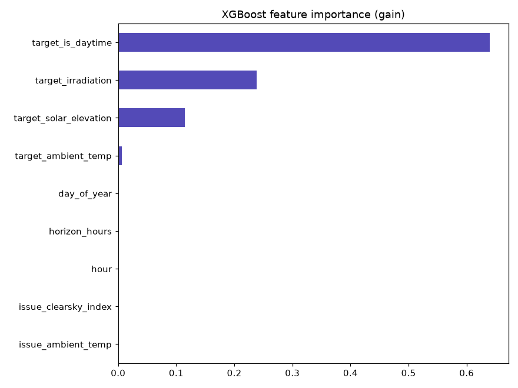

# Sprint 2 - Modeling: linear baseline vs tuned tree models

Script: `ml/train_models.py`. Split: time-based, by `issue_time` - train on everything
before 2020-06-05 22:45, calibrate prediction intervals on the next 6 days (val),
report final metrics on the last 6 days (test, touched once). The final model uses
nine live-consistent features; LightGBM uses Optuna
with three spaced four-day validation windows and early stopping. Never a random
split - see `docs/DECISIONS.md` for why that would leak.

## Headline results

| Model | MAE | RMSE | MAPE (daytime only) | MAE (night rows) |
|---|---|---|---|---|
| Linear regression baseline | 424.3 | 663.2 | 19.8% | 167.5 |
| XGBoost | 353.9 | 692.2 | **8.7%** | **11.8** |
| **Optuna-tuned LightGBM** | **291.7** | **609.6** | **5.8%** | **1.8** |

MAPE is computed only over rows where actual generation > 100 (daytime) - with
~46.6% of rows at exactly 0, a naive MAPE divides by zero constantly. The
zero/near-zero subset is reported separately as MAE instead. LightGBM is better
overall and during daytime, while the reduced-feature XGBoost has a larger
nighttime error because the explicit current-power placeholders were removed.

LightGBM is the best model on this untouched test window: it achieves
291.7 kW MAE, 609.6 kW RMSE, and 5.8% daytime MAPE. Its night MAE is 1.8 kW.
The improvement is especially meaningful because all three models use the same
chronological split and the test period is not used during tuning.

RMSE still penalizes large errors more heavily than MAE, so sudden weather
transitions remain harder than typical solar-generation periods.

## LightGBM Optuna tuning

LightGBM was tuned with 20 Optuna TPE trials. Each trial used three spaced,
chronological four-day validation windows, native missing-value handling, and
early stopping after 50 rounds without validation improvement. The objective was
a balanced score: 70% overall MAE and 30% daytime MAE. The final tree count was
the mean best iteration across the validation folds.

Selected values after removing the three live-zero power anchors:

| Parameter | Value |
|---|---:|
| `learning_rate` | 0.0296 |
| `num_leaves` | 21 |
| `max_depth` | 7 |
| `min_child_samples` | 79 |
| `subsample` | 0.8859 |
| `colsample_bytree` | 0.8885 |
| `reg_lambda` | 3.3225 |
| `reg_alpha` | 0.0383 |
| `n_estimators` | 758 |

The regularization, limited tree depth, minimum child size, subsampling, and
early stopping reduce the risk of fitting individual weather days. Trial results
are saved in `docs/eda/lightgbm_optuna_trials.csv`, parameters in
`ml/models/lightgbm_best_params.json`, and the trained model in
`ml/models/lightgbm_model.joblib`.

## Horizon comparison

| Model | 1-24h MAE | 25-48h MAE | 49-72h MAE |
|---|---:|---:|---:|
| Linear regression | 431.7 | 425.2 | 411.7 |
| XGBoost | 355.5 | 361.7 | 341.3 |
| LightGBM | **292.5** | **301.2** | **278.1** |

## Reproducibility note

The current tree-model training uses `random_state=42` and `n_jobs=1` where
supported, reducing machine-to-machine variation. Exact scores can still change
if the library versions, training data, or feature contract changes. The results
reported above are from the current nine-feature contract and must not be compared
directly with the earlier 12-feature experiment without noting that the inputs
were different.

## EDA prediction confirmed

The EDA (`docs/EDA.md`, section 6) flagged `issue_ac_power` and
`issue_ac_power_roll_1hr` as a moderately collinear pair (VIF ~8.2 each) and said
to watch for unstable/sign-flipped coefficients in the linear baseline if it came
up. It did: `issue_ac_power` = +0.0038, `issue_ac_power_roll_1hr` = -0.0022 -
opposite signs on two features that should logically move together. This isn't a
bug, it's exactly the symptom the EDA predicted, now confirmed on real output -
and reproduced identically on a second machine.

## Feature importance - resolves an earlier open question

The current LightGBM artifact is the live model. Feature importance is calculated
from the model's tree splits and normalized by the backend before being displayed.
The three strongest physical inputs are expected to be `target_irradiation`,
`target_solar_elevation`, and `target_is_daytime`:

| Feature group | Earlier experiment | Current interpretation |
|---|---|---|
| Solar/astronomy features | ~99% combined | Primary live signal |
| Removed power anchors | ~0.1% combined in the earlier experiment | Excluded because live values were artificial zeros |

The exact split among the solar and astronomy features can move because they are
correlated and interchangeable in tree splits. Importance is explanatory, not a
causal percentage of generation.

This resolves the current-state anchor issue conservatively: the live model does
not pretend to know current plant output. If SCADA becomes available, the removed
power-anchor features can be restored after historical SCADA data is added and the
model is retrained and reevaluated.

## Prediction intervals

Calibrated on the val set only (never touched by training or by the reported test
metrics) - 90th-percentile absolute residual, by horizon bucket (this run):

| Horizon | p90 absolute residual |
|---|---|
| 1-24h | 692.1 |
| 25-48h | 766.5 |
| 49-72h | 895.5 |

Band = prediction +/- the bucket's value, applied at inference. Grows with horizon,
as it should - confirms the calibration is behaving sensibly rather than
arbitrarily.

## Feature reduction decision

The original model contained three current-power features:
`issue_ac_power`, `issue_ac_power_roll_1hr`, and `issue_ac_power_roll_1day`.
During live inference, no SCADA feed exists, so all three were set to `0.0`.
They were removed from both the training and backend feature contracts to avoid
training on inputs that are artificial in production. The resulting model uses
nine features that are available from live weather, timestamps, or pvlib.

This is a deployment-consistency improvement, but it has a measured accuracy
trade-off on the single test window: LightGBM MAE changed from 267.8 kW to
291.7 kW and daytime MAPE from 5.0% to 5.8%. The reduced model remains better
than reduced-feature XGBoost and is the honest model for the current no-SCADA
prototype. If SCADA becomes available, these features should be restored only
after adding historical SCADA values and retraining.

## Decisions made

- **Model choice for the live system: Optuna-tuned LightGBM.** It has the lowest
  test MAE, RMSE, and daytime MAPE. XGBoost remains stored as a benchmark/fallback
  and has slightly lower nighttime MAE.
- **Hyperparameter tuning:** LightGBM uses 20 Optuna trials, three spaced
  chronological validation windows, regularization, subsampling, and early
  stopping. The final model uses the mean best iteration from those folds.
- **Model artifacts are stored separately:** `lightgbm_model.joblib` is loaded by
  the backend, while `xgboost_model.joblib` and `linear_baseline.joblib` remain
  available for comparison and fallback.
